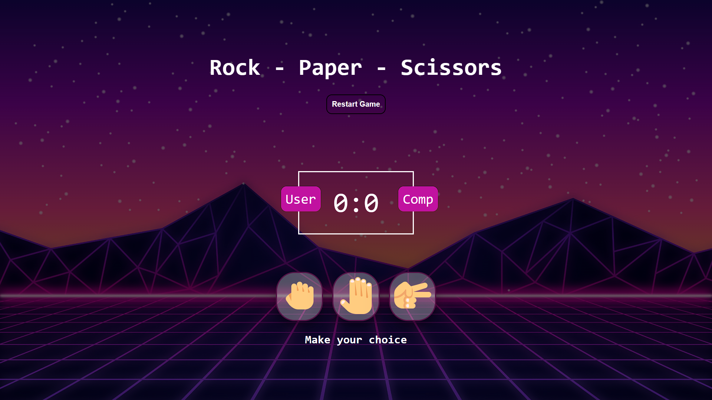

<h1 align="center">Rock-Paper-Scissors (✊🖐✌) Game</h1>

<h3 align="center">Simple site to play rock-paper-scissor game.</h3>

<p align="center">
  <a href="#-about-the-project">ABOUT THE PROJECT</a>&nbsp;&nbsp;&nbsp;|&nbsp;&nbsp;&nbsp;
  <a href="#-getting-started">GETTING STARTED</a>&nbsp;&nbsp;&nbsp;|&nbsp;&nbsp;&nbsp;
  <a href="#-how-to-contribute">HOW TO CONTRIBUTE</a>&nbsp;&nbsp;&nbsp;|&nbsp;&nbsp;&nbsp;
  <a href="#-license">LICENSE</a>
</p>

---

<p align="center">
  
</p>

---


## 💡 About the project

This is an open source project that serves as a free alternative to Rock-Paper-Scissor Game website.

## 🚀 Getting started

If you installed git you can clone the code to your machine, or download a ZIP of all the files directly.
[Download the ZIP from this location](https://github.com/KunalUpadhyay02/Rock-Paper-Scissors/archive/refs/heads/main.zip), or run the following [git](https://git-scm.com/downloads) command to clone the files to your machine:
```bash
git clone https://github.com/KunalUpadhyay02/Rock-Paper-Scissors
```
- Once the files are on your machine, open the Rock-Paper-Scissors folder in [Visual Studio Code](https://code.visualstudio.com/) or in [Atom](https://atom.io/).
- With the files open in Visual Studio Code, press the **Go Live** button at the bottom of the window to launch the files with [Live Server](https://marketplace.visualstudio.com/items?itemName=ritwickdey.LiveServer).
- - With the files open in Atom, press the **Win+Shift+C** Key to launch the files with Live Server.
- If you want then change the texts in the `index.html` file.
- Change the colors and fonts in the `style.css` file.

## 👓 Step to make your own Rock✊-Paper🖐-Scissors✌ Web page Game:

Step 1. Fork this repository and boom you wil get this repository in your profile section.<br>
Step 2. You can edit html and css file to change the design its all up to you.<br>
Step 3. Go to  settings of the repository and publish github page.<br>
Step 4. Boom! Your own free Rock-Paper-Scissor Game like page is ready now, you can access this page through world-wide by given `github-url`.<br>
Step 5. Don't Forgot to star this repository.

## 🤔 How To Contribute

Step 1. Fork This repository;<br>
Step 2. Create a branch with your feature: `git checkout -b my-feature`;<br>
Step 3. Commit your changes: `git commit -m "feat: my new feature"`;<br>
Step 4. Push to your branch: `git push origin my-feature`.<br>

Optional : Once your pull request has been merged, you can delete your branch.
<br>
<br>
Contributions are always welcome😊!

## 📝 License

This project is under the MIT license. See the [LICENSE](LICENSE.md) file for more details.

## References
The idea came from the Basic Javascript Course from Platzi and took it as a reference. The tutorials of @TraversiMedia and @whatsdev was taken as a reference to understand better concepts and improve the design.

